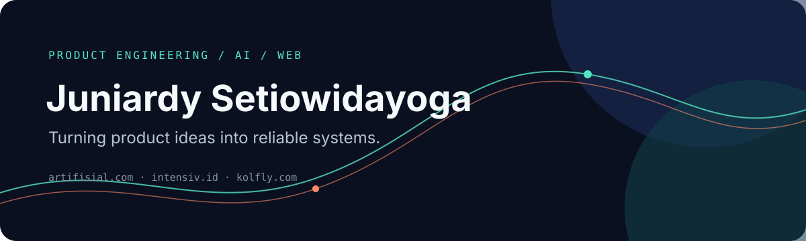

  

  <strong>Senior Full-Stack & AI Product Engineer</strong> 
  I build useful products from the first sketch to production.

  <a href="https://artifisial.com">Artifisial</a>
  ·
  <a href="https://intensiv.id">Intensiv</a>
  ·
  <a href="https://kolfly.com">Kolfly</a>

## What I do

I work at the intersection of product thinking, full-stack engineering, and AI. My role usually spans product discovery, technical planning, implementation, testing, deployment, and the iteration that follows release.

## Products I work on

<table>
  <tr>
    <td width="33%" valign="top">
      <strong><a href="https://artifisial.com">Artifisial</a></strong> 
      Practical AI products, solutions, and learning experiences.
    </td>
    <td width="33%" valign="top">
      <strong><a href="https://intensiv.id">Intensiv</a></strong> 
      An AI-powered learning and digital product platform.
    </td>
    <td width="33%" valign="top">
      <strong><a href="https://kolfly.com">Kolfly</a></strong> 
      An AI marketing platform for KOL campaigns and content workflows.
    </td>
  </tr>
</table>

## How I work

| Product first | Ship end to end | Improve with evidence |
| --- | --- | --- |
| Start with the user problem and the value to create. | Own the path from architecture to deployment. | Use feedback, data, and production reality to guide the next iteration. |

## Technical toolkit

**Frontend**: TypeScript, React, Next.js, Vue.js, Tailwind CSS  
**Backend**: Node.js, NestJS, Express, Laravel, REST APIs, webhooks  
**Data**: PostgreSQL, MySQL, MongoDB, Redis, Kafka, Elasticsearch  
**Delivery**: Docker, GitHub Actions, CI/CD, Cloudflare, Vercel, GCP  
**Specialised**: AI product integration, payment workflows, Web3, smart contracts

## Connect

<a href="https://www.linkedin.com/in/juniardysetio">LinkedIn</a>
