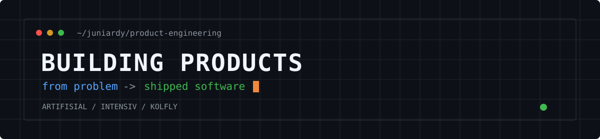

  

<h1>Hi, I'm Juniardy.</h1>

  I'm a <strong>Product Engineer</strong> focused on turning ambiguous product ideas into useful, reliable software.

  After nearly a decade working across frontend, backend, AI, and infrastructure, I'm now focused on the full product loop: understanding the problem, shaping the solution, building it, shipping it, and learning from what happens next.

## Currently building

I'm currently focused on three products:

- <a href="https://artifisial.com">Artifisial</a>
- <a href="https://intensiv.id">Intensiv</a>
- <a href="https://kolfly.com">Kolfly</a>

## What I work on

- Product discovery and technical direction
- Full-stack web applications and backend systems
- AI features that solve real product problems
- Shipping, operating, and improving products in production

## Technical toolkit

  

**Frontend**: TypeScript, React, Next.js, Vue.js, Tailwind CSS  
**Backend**: Node.js, NestJS, Express, Laravel, REST APIs, webhooks  
**Data**: PostgreSQL, MySQL, MongoDB, Redis, Kafka, Elasticsearch  
**Delivery**: Docker, GitHub Actions, CI/CD, Cloudflare, Vercel, GCP  
**Also**: AI product integration, payment workflows, Web3, smart contracts

## Connect

